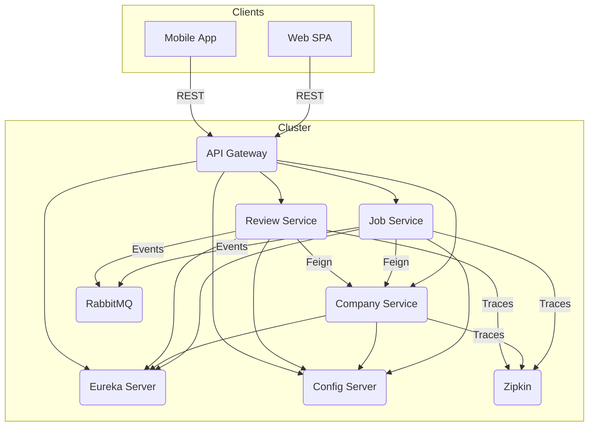

# TalentHive‑MS 🐝

*A cloud‑native, Kubernetes‑ready job‑marketplace built with Spring Boot microservices.*

---


> **TalentHive‑MS** is a modular suite of three Spring Boot microservices — **Job**, **Company**, and **Review** — orchestrated through Kubernetes and enriched with observability, resilience, and centralized configuration. The project demonstrates how to build, deploy, and operate production‑grade Java microservices with modern DevOps tooling.

---

## ✨ Features

| Capability                   | Implementation                                                             |
| ---------------------------- | -------------------------------------------------------------------------- |
| Service Discovery            | **Eureka Server** (Service Registry)                                       |
| API Gateway                  | **Spring Cloud Gateway**                                                   |
| Sync Communication           | **OpenFeign** + Load‑balanced `RestTemplate`                               |
| Centralized Configuration    | **Spring Cloud Config** backed by **Git**                                  |
| Resilience & Fault Tolerance | **Resilience4j** (Retry, Circuit‑Breaker, RateLimiter)                     |
| Distributed Tracing          | **Zipkin**                                                                 |
| Messaging (optional)         | **RabbitMQ** (decoupled async events)                                      |
| Persistence                  | **PostgreSQL** (one schema per service)                                    |
| Containerization & CI/CD     | **Docker** images → **Kubernetes** manifests / Helm chart → GitHub Actions |

---

## 🏗 Architecture



*Diagrams generated with [Mermaid](https://mermaid-js.github.io/) — update or replace with your own visuals if needed.*

---

## 🛠 Tech Stack

* **Java 17**, **Spring Boot 3.x**, **Spring MVC**
* **Spring Cloud** (Eureka, Gateway, Config, OpenFeign)
* **PostgreSQL** (per‑service DB)
* **Resilience4j** for fault handling
* **Zipkin** for distributed tracing
* **RabbitMQ** for event‑driven async flows (optional)
* **Maven** for build automation
* **Docker** for containerization
* **Kubernetes** (Helm + Kustomize friendly) for orchestration

---

## 🚀 Quick Start (Local)

> Requires Docker ≥ 24 & Docker Compose.

```bash
git clone https://github.com/<your‑handle>/TalentHive‑MS.git
cd TalentHive‑MS
# Build all service images
./mvnw clean package -DskipTests
# Spin up entire stack
docker compose -f infra/docker-compose.yaml up --build -d
```

After a few seconds:

| Service          | URL                                                |
| ---------------- | -------------------------------------------------- |
| API Gateway      | [http://localhost:8080/](http://localhost:8080/)   |
| Eureka Dashboard | [http://localhost:8761/](http://localhost:8761/)   |
| Zipkin UI        | [http://localhost:9411/](http://localhost:9411/)   |
| Config Server    | [http://localhost:8888/](http://localhost:8888/)   |
| RabbitMQ UI      | [http://localhost:15672/](http://localhost:15672/) |

Credentials & ports are configurable via **`infra/.env`**.

---

## 🎛 Configuration Management

All environment‑specific properties live in the Git‑backed config‑repo under `config‑repo/`.
Files follow the convention `service‑name-<profile>.yml` — eg. `jobservice-prod.yml`.
Update values → push → affected services refresh *live* thanks to **Spring Cloud Bus**.

---

## 🧪 Running Tests

```bash
./mvnw test            # unit + slice tests
./mvnw verify -P it    # integration tests with Testcontainers
```

---

## ☸️ Deploying to Kubernetes (Minikube)

```bash
minikube start                # or kind / k3d / your cloud cluster
kubectl apply -k k8s/base     # Deploy core infrastructure
kubectl apply -k k8s/overlays/dev   # Deploy services (dev profile)
```

*Helm charts are provided in `/helm` for production‑grade installs.*

---

## 🔌 API Reference

Each microservice ships with **Springdoc‑OpenAPI** — once running, explore:

```
http://<host>:<port>/swagger-ui.html
```

| Service         | Default Port | Purpose                            |
| --------------- | ------------ | ---------------------------------- |
| Job Service     | 8081         | CRUD jobs, search, match by skills |
| Company Service | 8082         | Manage companies & hiring statuses |
| Review Service  | 8083         | Submit & read company reviews      |

---

## 🛡 Security Notes

* JWT‑based stateless auth layer pluggable at the Gateway.
* Profiles: `dev`, `test`, `prod` — **never** commit secrets; use K8s Secrets or Vault.

---

## 🤝 Contributing

1. Fork ➜ Create Branch ➜ Commit ➜ PR
2. Please run `./scripts/lint.sh` & all tests before pushing.
3. Document new endpoints in the OpenAPI spec.

Looking for good first issues? Check the **issues** tab!

---

## 📜 License

Distributed under the **MIT License** — see `LICENSE` for details.

---

## 💡 👨‍💻 Author
Developed with ❤️ by **Vikas Kumar Gupta** 🚀

---

## 📞 Contact
For any queries or contributions, please reach out:
- 📧 Email: vikasgup074@gmail.com  
- 🔗 LinkedIn: [Vikas Kumar Gupta](https://www.linkedin.com/in/work-with-vikas/)  
- 💻 GitHub: [Vikas9kumargupta](https://github.com/Vikas9kumargupta)  


